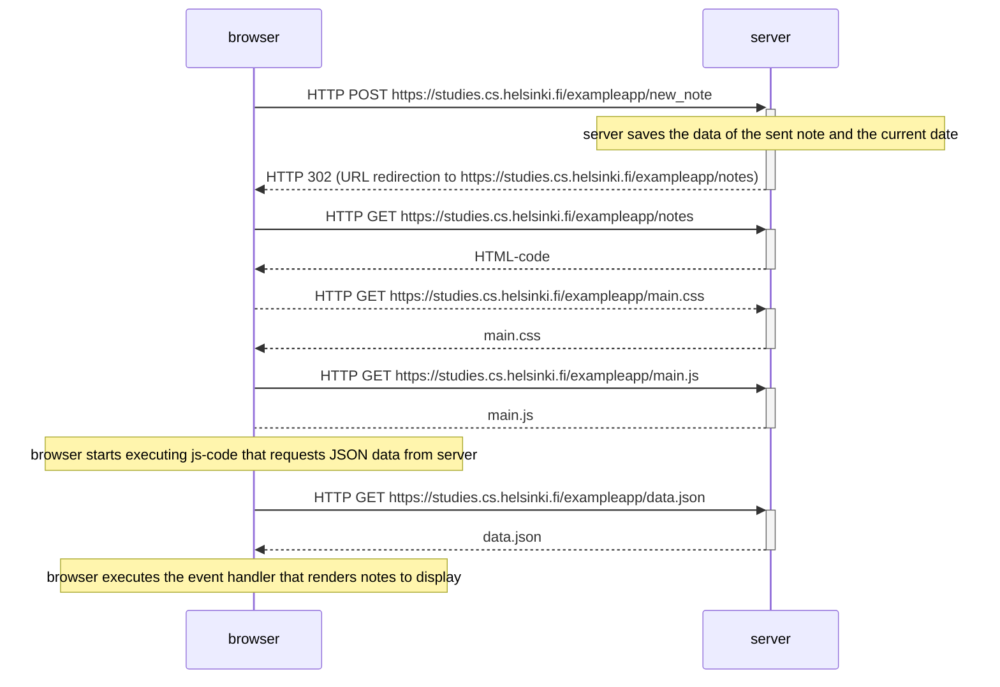

```mermaid
sequenceDiagram
    participant browser
    participant server
    browser->>+server: HTTP POST https://studies.cs.helsinki.fi/exampleapp/new_note
    Note over server: server saves the data of the sent note and the current date
    server-->>-browser: HTTP 302 (URL redirection to https://studies.cs.helsinki.fi/exampleapp/notes)
    browser->>+server: HTTP GET https://studies.cs.helsinki.fi/exampleapp/notes
    server-->>-browser: HTML-code
    browser-->>+server: HTTP GET https://studies.cs.helsinki.fi/exampleapp/main.css
    server-->>-browser: main.css
    browser->>+server: HTTP GET https://studies.cs.helsinki.fi/exampleapp/main.js
    server-->-browser: main.js
    Note over browser: browser starts executing js-code that requests JSON data from server 
    browser->>+server: HTTP GET https://studies.cs.helsinki.fi/exampleapp/data.json
    server-->>-browser: data.json
    Note over browser: browser executes the event handler that renders notes to display
```