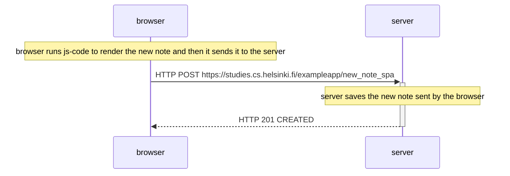

```mermaid
sequenceDiagram
    participant browser
    participant server
    Note over browser: browser runs js-code to render the new note and then it sends it to the server
    browser->>+server: HTTP POST https://studies.cs.helsinki.fi/exampleapp/new_note_spa
    Note over server: server saves the new note sent by the browser
    server-->>-browser: HTTP 201 CREATED
```

